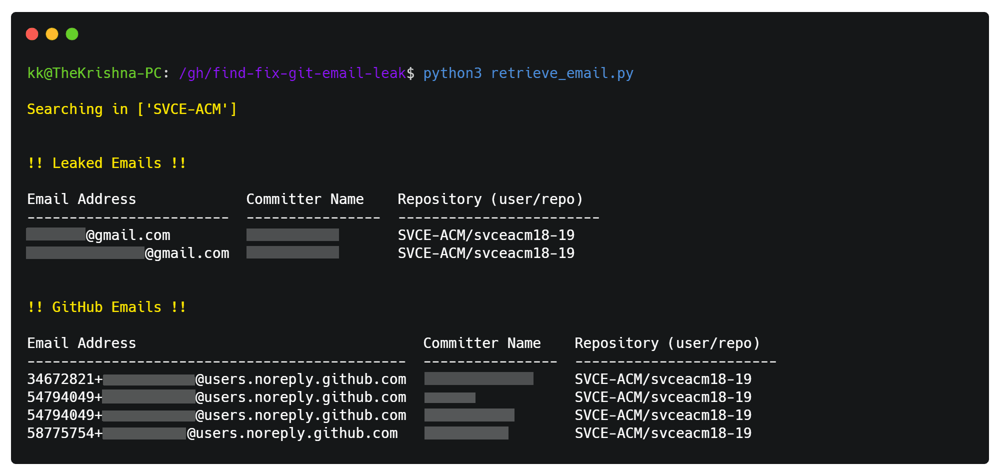

<h1 align="center">
  Find and Fix Git Email Leak
</h1>

<h4 align="center">Find and Fix publicly accessible commit email addresses.</h4>

<p align="center">
  <a href="https://www.python.org"></a>
  <a href="/LICENSE"></a>
</p>

GitHub uses your commit email address to associate commits with your GitHub account. When a user makes commits to a public repository, their email address is pushed with the commit. 

If you'd like to keep your personal email address private, you can use a GitHub-provided `no-reply` email address as your commit email address. GitHub provides some [instructions](https://help.github.com/articles/setting-your-email-in-git/) on keeping your personal email address private, but it seems that GitHub users either don't know or don't care that their email address may be exposed.

However, any commits you made before changing your commit email address are still associated with your previous email address. This is why this repository exists.  The script will clone all accessible repositories, change the committer email from all commits and push it back to GitHub. 

## Getting Started

### Prerequisites
What things you need to run the program:
- Python3 Compiler
- Install the following Packages from PyPi by using the following commands:
  - ```bash
    $ pip3 install -r requirements.txt
    ```

### Usage
- First, we need to generate a personal access token that will allow us to authenticate against the API. We can get one at https://github.com/settings/tokens and by clicking on *Generate new token*. Select `Repo` and `User` scopes for the token.
- Rename `.env.sample` to `.env` and populate the appropriate values. 
- Run `retrieve_email.py` to check for all leaked email addresses. This script uses [recent events](https://developer.github.com/v3/activity/events/) via the GitHub API to find the leaked email addresses. An example screenshot is attached:
  - ```bash
    $ python3 retrieve_email.py
    ```
  -  
  -  
- Once you identified the leaked email addresses, populate them back to the `.env` file.
- Now, run `email_fix.py` to replace the committer email addresses with the `CORRECT_EMAIL` from `.env` (preferably the GitHub-provided `no-reply` email address). Changes might take up to 90 days to reflect in the GitHub Events API.
- Repeat the process if you have multiple leaked email addresses.
- [GitHub Docs: Block commits you push from the command line that expose your personal email address](https://docs.github.com/en/account-and-profile/setting-up-and-managing-your-github-user-account/managing-email-preferences/blocking-command-line-pushes-that-expose-your-personal-email-address)

### Notes
- The script does not preserve the `SHA1`s for previous tags, versions and objects. 
- Currently, works only on the parent or root branch (`master`, `main`, etc). Will increase the scope to other branches if I have the time.

### Acknowledgments
- Hat tip to anyone whose code was used.

## Disclaimer
```
I shall not be liable for any consequential, incidental, direct, indirect, special, or other damages whatsoever (including, without limitation, damages for loss of business profits, business interruption, loss of business information, or other pecuniary loss). Run this at your own risk.  
```


 
<p align="center">
  Made with ❤️ by <a href="https://github.com/bearlike">Krishnakanth Alagiri</a>
</p>